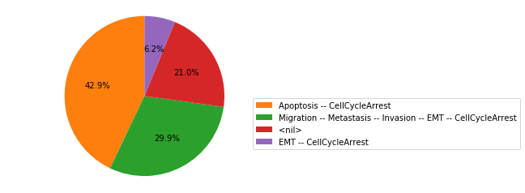

pyMaBoSS
========

pyMaBoSS is a python API for the `MaBoSS <https://maboss.curie.fr/>`_ software.
It can be used inside the `Colomoto docker <https://hub.docker.com/r/colomoto/colomoto-docker/>`_.
The API is loaded by running the following line in Python::
   
   import maboss
    
Once loaded, it allows you to quickly load a MaBoSS model::
   
   sim = maboss.load("metastasis.bnd", "metastasis.cfg")    
   
And then to simulate the model and plot the simulation results::
   
   res = sim.run()
   res.plot_piechart()

  
  